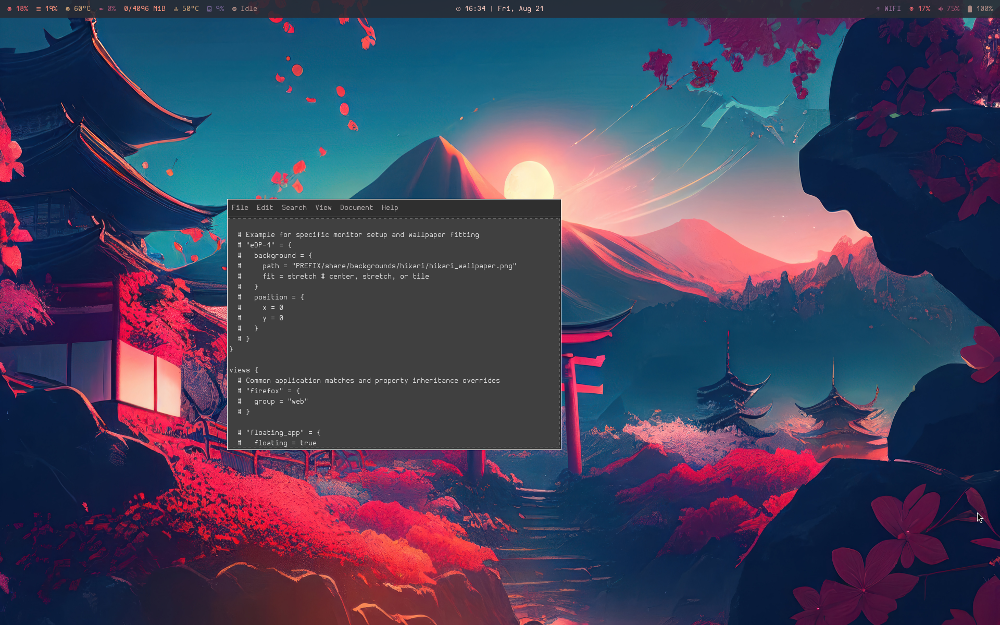

# Hikari Sakura - FreeBSD Wayland Compositor



## Description

*Hikari Sakura* is a FreeBSD-focused revamp and modernization of the original Hikari taken from https://github.com/antaz/hikari (which has since been abandoned upstream). It is very different from the original and is focused on being a comprehensive desktop environment specifically built for FreeBSD as the first purpose-built Wayland desktop environment for FreeBSD.

It is a stacking Wayland compositor with additional tiling capabilities,
it is heavily inspired by the Calm Window manager (cwm(1)). Its core concepts
are *views*, *groups*, *sheets* and the *workspace*.

The workspace is the set of views that are currently visible.

A sheet is a collection of views, each view can only be a member of a single
sheet. Switching between sheets will replace the current content of the
workspace with all the views that are a member of the selected sheet. _Hikari Sakura_
has 9 general purpose sheets that correspond to the numbers **1** to **9** and a
special purpose sheet **0**. Views that are a member of sheet **0** will
always be visible but stacked below the views of the selected sheet.

Groups are a bit more fine grained than sheets. Like sheets, groups are a
collection of views. Unlike sheets you can have a arbitrary number of groups
and each group can have an arbitrary name. Views from one group can be spread
among all available sheets. Some operations act on entire groups rather than
individual views.

## Setting up Wayland on FreeBSD

Wayland currently requires some care to work properly on FreeBSD. This section
aims to document the recent state of how to enable Wayland on the FreeBSD
`STABLE` branch and will change once support is being improved.

### Mouse configuration

To make mice work `kern.evdev.rcpt_mask` should be set to `12`. Depending on
your version of FreeBSD this is done automatically or via setting the value in
`/etc/sysctl.conf`.

Some systems might require `moused` for mice to work. Enable it with `service
moused enable`. This requires setting `kern.evdev.rcpt_mask` to `3`.

### Setting up XDG\_RUNTIME\_DIR

Wayland compositors require `XDG_RUNTIME_DIR` to be set to a user-owned
directory with mode `0700`. Some Wayland clients (e.g. native Wayland `firefox`)
require `posix_fallocate` to work in that directory. This is not supported by
ZFS, therefore on ZFS-root systems you must ensure `/tmp` is backed by `tmpfs`:

1. Prevent the ZFS dataset from mounting over the tmpfs:

```sh
sudo zfs set canmount=noauto zroot/tmp
```

1. Add a `tmpfs` entry to `/etc/fstab` (if not already present):

```sh
tmpfs   /tmp   tmpfs   rw,mode=1777,size=256m   0   0
```

1. Reboot, then verify `/tmp` is mounted as `tmpfs`:

   ```sh
   mount | grep ' on /tmp '
   ```

   The output should show `tmpfs` as the filesystem type, for example:
   `tmpfs on /tmp (tmpfs, ...)`. A line showing `zfs` instead means `/tmp`
   is still backed by ZFS — re-check every setup step above, including the
   `/etc/fstab` entry, and make sure the system has been rebooted.

> **Note:** Without step 1, ZFS automount will mount `zroot/tmp` *over* the
> fstab tmpfs entry, and `/tmp` will still be ZFS despite the fstab line.

If your system does not set `XDG_RUNTIME_DIR` automatically (e.g. FreeBSD with
`seatd` and no `elogind`), the `start-hikari` wrapper script will create one at
`/tmp/hikari-runtime-$UID` with the correct permissions. You can also set it
manually:

```sh
export XDG_RUNTIME_DIR=/tmp/runtime-$(id -u)
mkdir -p -m 0700 "$XDG_RUNTIME_DIR"
```

### Setting up PAM

Setting up PAM is needed to give Hikari Sakura the ability to unlock the screen when
using the screen locker. Copy `etc/pam.d/hikari-unlocker.FreeBSD` from the
source tree to `/usr/local/etc/pam.d/hikari-unlocker`.

### Setting up the keyboard layout

`hikari` natively configures its keyboards via the `inputs { keyboards { ... } }` block in `hikari.conf`. You can directly specify your `xkb` layout, options, repeat rates, and delays there.

If a keyboard is not explicitly configured in `hikari.conf`, Hikari Sakura will fall back to using `xkb` environment variables. To select a layout this way, set `XKB_DEFAULT_LAYOUT` before starting Hikari Sakura.

```sh
export XKB_DEFAULT_LAYOUT="de(nodeadkeys),de"
```

## Configuration & Customization

Hikari Sakura is configured using `libucl` syntax. The configuration file is expected to be located at `$XDG_CONFIG_HOME/hikari/hikari.conf`. If it does not exist, Hikari Sakura will fall back to the default config installed at `${ETC_PREFIX}/etc/hikari/hikari.conf`.

The configuration file allows you to define:
- **ui**: Colors, border sizes, fonts, and gaps.
- **actions**: User-defined shell commands (e.g., launching a terminal, volume control).
- **bindings**: Keyboard and mouse shortcuts mapped to actions or internal operations.
- **layouts**: Defined workspace tiling patterns.
- **views**: Window matching rules (by app ID) to automatically group, float, or pin applications to specific sheets.

**Capabilities & Limitations:**
- You can use environment variables (e.g., `$TERMINAL`) in the configuration file; they will be substituted when the configuration is loaded.
- Structural changes like UI themes, custom actions, and new bindings can be hot-reloaded using the `reload` action (default: `L+S+r`).
- Hikari Sakura does not support conditional statements or complex logic within the config file itself.
- Some environment-level initializations (like XWayland) require a full restart of the compositor to apply.
- Hikari Sakura does provide a built-in status bar. You can also use external layer-shell components like `waybar` or the included `hikari-topbar` for system telemetry.

## Laptop Optimization

When using Hikari Sakura on a laptop, especially on FreeBSD, you may want to map your multimedia keys and handle the lid switch.

### Multimedia Keys (Volume & Brightness)

Hikari Sakura natively understands `XF86` keysyms via `xkbcommon`. You can define custom actions that invoke FreeBSD's native `mixer(8)` and `backlight(8)` utilities, and bind them to your media keys in `hikari.conf`.

```ucl
actions {
  vol-up       = "mixer vol +5"
  vol-down     = "mixer vol -5"
  vol-mute     = "mixer vol.mute=^"
  bright-up    = "backlight +5"
  bright-down  = "backlight -5"
}

bindings {
  keyboard {
    "0+XF86AudioRaiseVolume"  = action-vol-up
    "0+XF86AudioLowerVolume"  = action-vol-down
    "0+XF86AudioMute"         = action-vol-mute
    "0+XF86MonBrightnessUp"   = action-bright-up
    "0+XF86MonBrightnessDown" = action-bright-down
  }
}
```
*Note: The `0+` prefix specifies that no modifier keys (like Super or Alt) are required.*

### Lid Switch Handling

Hikari Sakura can natively parse switch events (like lid switches) through the `inputs { switches { ... } }` block in `hikari.conf`. You can bind these events to any Hikari Sakura action. For example, to lock the screen when the lid closes:

```ucl
inputs {
  switches {
    "Control Method Lid Switch" = lock
  }
}
```

However, Hikari Sakura itself does not manage suspend/resume states. On FreeBSD, suspend is typically handled by `devd(8)` or `acpi(4)`. 
Ensure `hw.acpi.lid_switch_state` is set appropriately via `sysctl` or `/etc/sysctl.conf` to trigger a suspend (e.g., state `S3`) when the lid is closed.

## Touchscreen & Trackpad Gestures

Hikari Sakura natively supports touchscreens and multi-finger trackpad gestures.

Touchscreens are attached to the same output layout as the mouse cursor, and touch input is forwarded to clients via the standard Wayland touch protocol. The first touch point of a new touch sequence also drives Hikari Sakura's own focus, raise, move, and resize behavior — the same as a left mouse click — so windows can be managed by tapping and dragging directly on a touchscreen. Additional simultaneous touch points are left for the client to interpret (e.g. pinch-to-zoom in a PDF viewer).

Trackpad swipe, pinch, and hold gestures (via `wlr_pointer_gestures_v1`) can be bound to Hikari Sakura actions in the `inputs { gestures { ... } }` block, using keys of the form `swipe-<direction>-<fingers>`, `pinch-<direction>-<fingers>`, or `hold-<fingers>`, where `<fingers>` is an integer from 1 to 5. A gesture that matches a binding triggers the action instead of being forwarded to the client; unmatched gestures are forwarded to the client. Update events are buffered until the gesture ends (in case it turns out to match a binding); a gesture with more than 128 update events has the excess silently dropped from what is forwarded.

```ucl
inputs {
  gestures {
    "swipe-left-3"  = workspace-cycle-next
    "swipe-right-3" = workspace-cycle-prev
    "pinch-in-3"    = view-toggle-maximize-full
    "hold-3"        = action-terminal
  }
}
```

## Building

Hikari Sakura currently only works on FreeBSD. This is unlikely to change. When building directly from the repository, breaking changes might be encountered due to the project being in its `first` stages; it is currently considered `unstable`. 

### Dependencies

* wlroots (0.20)
* wayland-protocols
* pango
* cairo
* libinput
* xkbcommon
* pixman
* libucl
* evdev-proto
* epoll-shim (FreeBSD)
* XWayland (optional, runtime dependency)

### Compiling and Installing

The build process produces three binaries — `hikari`, `hikari-unlocker` and
`hikari-topbar` — plus a `start-hikari` wrapper script.

* `hikari-unlocker` checks credentials for unlocking the screen and is installed
  setuid root (`4555`).
* `hikari-topbar` feeds the native top bar with system telemetry. It runs as a
  separate unprivileged process (`555`) so its sensor polling cannot stall the
  compositor's event loop.
* `hikari` can rely on `seatd` to gain root privileges when required; however, if
  needed it can also be installed with root setuid — see "Installing with SUID"
  below.

All four files are installed to `${PREFIX}/bin` by `make install`, which also
installs the default configuration to `${ETC_PREFIX}/etc/hikari/hikari.conf`, the
PAM policy to `${ETC_PREFIX}/etc/pam.d/hikari-unlocker`, the manpage, the default
wallpaper, and the `hikari.desktop` wayland-session entry.

### Launching

Use `start-hikari` to launch the compositor. It sets up the required Wayland
session environment before executing the `hikari` binary:

* Clears leaked `WAYLAND_DISPLAY` / `DISPLAY` variables
* Creates `XDG_RUNTIME_DIR` if the system did not provide one
* Validates `XDG_RUNTIME_DIR` ownership (current user) and permissions (`0700`)
* Warns if `XDG_RUNTIME_DIR` resides on ZFS (incompatible with `posix_fallocate`)
* Resolves the `hikari` binary from the script's own directory, `$PATH`, or `./`
* Wraps execution in a D-Bus session if one is not already active

```sh
start-hikari
```

If you are using a display manager (GDM, SDDM, greetd), the installed
`hikari.desktop` session file will call `start-hikari` automatically.

Hikari Sakura can be configured via `$XDG_CONFIG_HOME/hikari/hikari.conf`, the
default configuration can be found under `${ETC_PREFIX}/etc/hikari/hikari.conf`
(depending on the value of `ETC_PREFIX` that was specified during the installation).

The default configuration expects your default terminal emulator to be specified
in the `$TERMINAL` environment variable.

The installation destination can be configured by setting `PREFIX` (default is
`/usr/local` and does not need to be given explicitly). If you want to install
Hikari Sakura into a directory other than `/usr/local` you always should state the
`PREFIX` when issuing `make`, since this information is also used to specify
where Hikari Sakura can find the default configuration on your system and is needed
during the compilation process. To override installation paths for `etc` specify
`ETC_PREFIX`.

#### Building on FreeBSD

Simply run `make`. The installation destination can be configured by setting
`PREFIX` (default is `/usr/local` and does not need to be given explicitly).

```sh
make
```

`uninstall` requires the same values for prefixes.

### Building with all features enabled

The following sections explain how to enabled features on an individual basis.
However, to enable every feature the build system offers the `WITH_ALL` flag.

```sh
make WITH_ALL=YES
```

#### Building with XWayland support

Hikari Sakura offers optional XWayland support which is enabled via setting
`WITH_XWAYLAND`.

```sh
make WITH_XWAYLAND=YES
```

#### Building with screencopy support

Screencopy support allows tools like `grim` to work with Hikari Sakura, it also
allows applications to copy the desktop content. This is disabled by default
and can be added by setting `WITH_SCREENCOPY`.

```sh
make WITH_SCREENCOPY=YES
```

#### Building with gammacontrol support

Gamma control is needed for tools like `redshift`. This is disabled by default
and can be enabled via setting `WITH_GAMMACONTROL`.

```sh
make WITH_GAMMACONTROL=YES
```

#### Building with layer-shell support

Some applications that are used to build desktop components require
`layer-shell`. Examples for this are `waybar`, `wofi` and `slurp`. To turn on
`layer-shell` support compile with the `WITH_LAYERSHELL` option.

```sh
make WITH_LAYERSHELL=YES
```

#### Building with virtual input support

Virtual input support is needed for applications like `wayvnc`.

```sh
make WITH_VIRTUAL_INPUT=YES
```

#### Building the manpage

Building the Hikari Sakura manpage requires [`pandoc`](http://pandoc.org/). To build
the manpage just run `make VERSION=1.0.0 doc`, where `VERSION` is the version
number that will be spliced into the manpage. The distribution tarball of
Hikari Sakura comes with a precompiled manpage removing the need for a `pandoc`
installation.

#### Installing with SUID

If Hikari Sakura should require root privileges for startup, state `WITH_SUID=YES`
during installation.

```sh
make WITH_SUID=YES install
```

#### Building a DEBUG build

In the case of a crash or a bug you should build a debug version of Hikari Sakura and
try to reproduce the issue. `DEBUG=YES` builds with debug symbols, disables
optimisation, and leaves `assert()` enabled (release builds define `NDEBUG`).
Extracting a stack trace for debugging purposes is also very helpful if you are
planning to submit a bug report.

```sh
make DEBUG=YES
```

AddressSanitizer is **not** enabled by `DEBUG=YES`. It is opt-in, because ASan
interferes with the privileged operations performed before the backend
initialises. Enable it explicitly when you need it:

```sh
make DEBUG=YES ASAN=YES
```
## Contributing

Please make sure you use `clang-format` with the accompanying `.clang-format`
configuration before submitting any patches.
